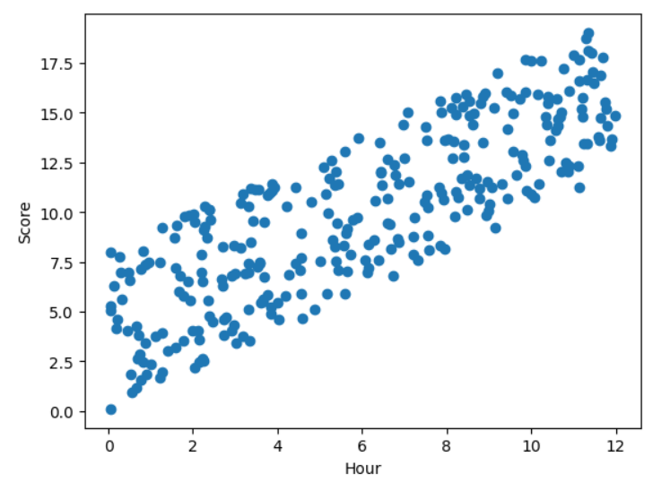

# Machine_learning_5
knn &amp; lls

## the boston data set by Scikit-learn library

the libraries used in this program: 
- Matplotlib
- Numpy
- Pandas
- Scikit-learn

Blue surface --> y_pred 

Red points --> (X: ZN and AGE / Y: PRICE of house)

--- 

x --> study hours

y --> grade of student

## Linear Least Squares :

### (test 1, test 2, test 3) they are the wrong Method,
### and the red line show us the Linear Least Squares method.

